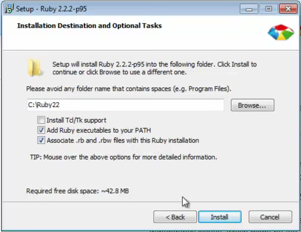

# How to install Ruby on Windows

Unlike [Ubuntu](como_instalar_no_ubuntu.md) and [MacOS](como_instalar_no_macos.md), install Ruby on Windows don't need a version manager, you'll just need a wizard just like any other Windows software

- To do this, go to [downloads](http://rubyinstaller.org/downloads/) page from [RubyInstaller](http://rubyinstaller.org)

- On *RubyInstallers* session, download the latest version for your computer, according to your operating system (32 or 64 bits). Today (10/11/2016), newer versions are as follows:

  

- Respectively, are versions for 32 and 64-bit, download the corresponding to your operating system when finished downloading, run the file

- Do the installation normally using NNF protocol (Next, Next, Finish) that comes with all versions of Windows

- On the next screen, select the options **Add Ruby executables to your PATH** and **Associate .rb and .rbw files with this Ruby installation** and proceed with the installation

  

- At the end, in your start menu in Ruby folder, run the Interactive Ruby and use the terminal to test the ruby POWERS!

And now you can go to your [first command](404_en.md) on irb or [go back](../../README.md) to README!
