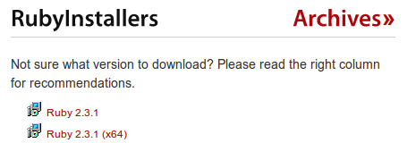
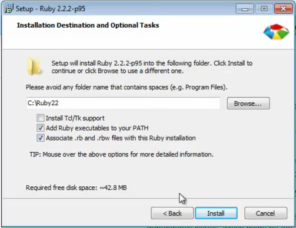

# How to install Ruby

Choice your operational system
- [MacOS](#macos)
- [Ubuntu](#ubuntu)
- [Windows](#windows)

## How to install Ruby on MacOS <a name="macos"></a>

### Installing Rbenv

- Install Rbenv
```bash
$ brew update
$ brew install rbenv
```

### Installing Ruby

- List all available Ruby versions:
```bash
$ rbenv install -l
```

- Install a Ruby version (in 10-11-2016 the currently ruby version is 2.3.1):
```bash
$ rbenv install 2.3.1
```

- Now, type `irb` (is for `interactive ruby shell`) on your console and see it working!
```bash
$ irb
irb(main):001:0> _
```

And now you can go to your [first command](404_en.md) on irb or [go back](../../README.md) to README!

## How to install Ruby on Ubuntu <a name="ubuntu"></a>

### Installing Rbenv

It may not seem, but the best way to install ruby in your computer is with a version manager. To do this, we'll use Rbenv just because it is very simple to use

Just follow the instructions! All this commands bellow has to be typed on your Console

- Check out rbenv into ~/.rbenv.
```bash
$ git clone https://github.com/rbenv/rbenv.git ~/.rbenv
```

- Add ~/.rbenv/bin to your $PATH for access to the rbenv command-line utility.
```bash
$ echo 'export PATH="$HOME/.rbenv/bin:$PATH"' >> ~/.bashrc
```
- Restart your shell so that PATH changes take effect
```bash
source ~/.bashrc
```
- Now check if rbenv was set up
```bash
$ type rbenv
#=> "rbenv is a function"
```

### Installing Ruby

- List all available Ruby versions:
```bash
$ rbenv install -l
```

- Install a Ruby version (in 10-11-2016 the currently ruby version is 2.3.1):
```bash
$ rbenv install 2.3.1
```

- Now, type `irb` (is for `interactive ruby shell`) on your console and see it working!
```bash
$ irb
irb(main):001:0> _
```

And now you can go to your [first command](404_en.md) on irb or [go back](../../README.md) to README!

## How to install Ruby on Windows

- Go to [downloads](http://rubyinstaller.org/downloads/) page from [RubyInstaller](http://rubyinstaller.org)

- On *RubyInstallers* session, download the latest version for your computer, according to your operating system (32 or 64 bits). Today (10/11/2016), newer versions are as follows:

  

- Respectively, are versions for 32 and 64-bit, download the corresponding to your operating system when finished downloading, run the file

- Do the installation normally using NNF protocol (Next, Next, Finish) that comes with all versions of Windows

- On the next screen, select the options **Add Ruby executables to your PATH** and **Associate .rb and .rbw files with this Ruby installation** and proceed with the installation

  

- At the end, in your start menu in Ruby folder, run the Interactive Ruby and use the terminal to test the ruby POWERS!

And now you can go to your [first command](404_en.md) on irb or [go back](../../README.md) to README!
