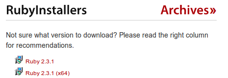

# Como instalar o Ruby no Windows

Diferente do [Ubuntu](como_instalar_no_ubuntu.md) e [MacOS](como_instalar_no_macos.md), instalar o Ruby no Windows não precisa de um gerenciador de versões, apenas de um instalador como qualquer programa para windows

- Para isso, vamos a página de [downloads](http://rubyinstaller.org/downloads/) do [RubyInstaller](http://rubyinstaller.org)

- Na sessão *RubyInstallers*, baixe a versão mais recente para o seu computador, respeitando a arquitetura do seu sistema operacional (32 ou 64 bits). No dia de hoje (11/10/2016), as versões mais recentes são as seguintes:

  

- Respectivamente, são as versões para 32 e 64 bits, baixe a correspondente ao seu sistema operacional, ao terminar o download, execute o arquivo

- Faça a instalação normalmente usando o protocolo NNF (Next, Next, Finish) que acompanha todas as versões do Windows

- Na seguinte tela, marque as opções **Add Ruby executables to your PATH** e **Associate .rb and .rbw files with this Ruby installation** e prossiga com a instalação

  

- Ao finalizar, no seu menu iniciar, na pasta Ruby, execute o Interactive Ruby e utilize o terminal para testar os PODERES do ruby!

E agora você pode seguir para o seu [primeiro comando](404_pt-br.md) no irb ou [voltar](../../README_pt-br.md) para o README!
